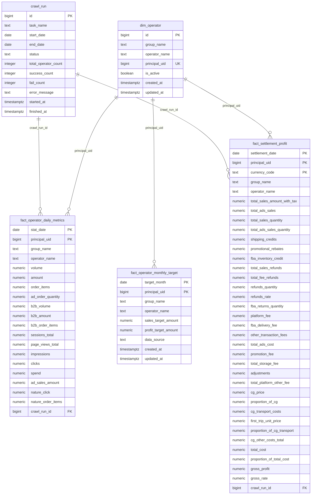

# 电商运营数据看板 SPEC

## 1. 文档说明

### 1.1 文档目标

本文档基于 `ecommerce-operations-dashboard-prd.md` 编写，用于指导电商运营数据看板的技术实现、数据建模、接口设计、部署方案和项目目录规划。

### 1.2 技术约束

- 所有开发、构建、部署、运行动作优先使用免费方案。
- 看板最终需要部署为可访问的网站，不以本地部署作为交付形态。
- 现有数据库和每日定时爬虫已完成，不重复建设采集系统。
- 看板只读取数据库，不直接执行爬虫。
- 前端不得暴露数据库连接串、领星 Token、SMTP 密码等敏感信息。
- MVP 阶段不启用 OpenAI 或其他付费 AI 能力，避免产生额外费用。

### 1.3 当前已具备能力

| 能力 | 当前状态 | 说明 |
| --- | --- | --- |
| 数据库 | 已完成 | Supabase/PostgreSQL |
| 每日爬虫 | 已完成 | GitHub Actions 定时执行 |
| 爬虫 Secrets | 已完成 | GitHub Repository Secrets |
| 失败邮件通知 | 已完成 | SMTP 相关 Secrets 已配置 |
| 看板网站 | 待开发 | 本 SPEC 覆盖实现方案 |

## 2. 推荐技术选型

### 2.1 总体架构

```text
用户浏览器
    -> Vercel 托管的 Next.js 网站
    -> Next.js Route Handlers / Server Actions
    -> Supabase PostgreSQL
    -> 返回聚合后的指标数据
```

### 2.2 技术栈清单

| 层级 | 推荐技术 | 是否免费 | 选择理由 |
| --- | --- | --- | --- |
| 前端框架 | Next.js + React + TypeScript | 免费开源 | 同时支持页面、API 路由、服务端查询，适合部署成网站 |
| 部署平台 | Vercel Hobby | 免费额度 | 对 Next.js 支持最好，可直接从 GitHub 自动部署 |
| 数据库 | Supabase PostgreSQL | 已有 | 数据库已经生成，只需读取；PostgreSQL 适合聚合查询 |
| 数据访问 | `pg` 或 `postgres.js` | 免费开源 | 轻量、直接、适合执行聚合 SQL |
| UI 样式 | Tailwind CSS | 免费开源 | 开发效率高，适合运营看板类界面 |
| UI 组件 | shadcn/ui + Radix UI | 免费开源 | 组件可控，适合构建筛选器、表格、弹窗和提示 |
| 图表库 | Recharts | 免费开源 | React 生态成熟，满足趋势图、柱状图、排行图需求 |
| 表格 | TanStack Table | 免费开源 | 支持排序、分页、列配置，适合明细表 |
| 日期处理 | date-fns | 免费开源 | 轻量，适合日期范围、月份、月化计算 |
| 数据校验 | Zod | 免费开源 | 用于 API 查询参数校验，降低接口风险 |
| 代码质量 | ESLint + Prettier | 免费开源 | 统一代码风格 |
| 测试 | Vitest + React Testing Library | 免费开源 | 覆盖指标公式和组件行为 |
| E2E 测试 | Playwright | 免费开源 | 验证线上页面基本交互 |
| CI/CD | GitHub Actions + Vercel 自动部署 | 免费额度 | GitHub 推送后自动部署到线上网站 |

### 2.3 为什么推荐 Next.js + Vercel

- 前端页面和后端 API 可以放在同一个项目中，减少项目复杂度。
- 数据库连接只发生在服务端 API，避免前端暴露 `DATABASE_URL`。
- Vercel 对 Next.js 有原生支持，适合快速部署成公网网站。
- Vercel Hobby 可免费开始使用，适合当前 MVP。
- 后续如访问量增长，可平滑升级或迁移。

### 2.4 免费部署策略

推荐方案：

```text
GitHub 仓库
    -> Vercel Hobby 自动构建部署
    -> 环境变量配置 DATABASE_URL
    -> 生成 *.vercel.app 线上访问地址
```

费用控制原则：

- 不使用付费 Vercel 插件。
- 不使用 Vercel KV、Blob、Edge Config 等额外计费能力。
- 不使用 OpenAI API 做默认功能。
- 不在看板项目中重复跑爬虫，避免构建和运行资源浪费。
- 所有图表、表格、样式库使用免费开源库。
- 如果 Supabase 或 Vercel 免费额度不足，再评估是否优化查询、缓存或升级。

备选方案：

| 方案 | 说明 | 适用情况 |
| --- | --- | --- |
| Cloudflare Pages + Functions | 也有免费额度，适合静态站和轻量 API | 如果更偏向 Cloudflare 生态 |
| Netlify Free | 可部署前端和 serverless functions | 如果团队已有 Netlify 经验 |
| GitHub Pages | 只适合纯静态页面 | 不推荐，因为不能安全直连数据库 |

## 3. 系统架构设计

### 3.1 模块划分

| 模块 | 职责 |
| --- | --- |
| Web UI | 页面展示、筛选交互、图表、表格 |
| API Layer | RESTful 接口、参数校验、错误处理 |
| Query Service | SQL 聚合查询、指标计算 |
| Database | 已有 Supabase PostgreSQL |
| Config | 环境变量、部署配置 |
| Tests | 指标公式测试、接口测试、页面冒烟测试 |

### 3.2 请求链路

```text
用户选择日期/组别/运营
    -> 前端调用 /api/v1/...
    -> API 使用 Zod 校验参数
    -> Query Service 拼接参数化 SQL
    -> PostgreSQL 返回聚合结果
    -> API 格式化响应
    -> 前端更新指标卡、趋势图、排行和表格
```

### 3.3 环境变量

看板项目需要配置：

| 环境变量 | 必填 | 用途 | 暴露给前端 |
| --- | --- | --- | --- |
| `DATABASE_URL` | 是 | 服务端连接 PostgreSQL | 否 |
| `APP_TIMEZONE` | 否 | 默认时区，建议 `Asia/Shanghai` | 否 |
| `NEXT_PUBLIC_APP_NAME` | 否 | 前端展示应用名称 | 是 |

不应配置到看板项目的变量：

| 变量 | 原因 |
| --- | --- |
| `LINGXING_AUTH_TOKEN` | 只属于 GitHub Actions 爬虫 |
| `SMTP_HOST` | 只属于失败邮件通知 |
| `SMTP_PORT` | 只属于失败邮件通知 |
| `SMTP_USERNAME` | 只属于失败邮件通知 |
| `SMTP_PASSWORD` | 只属于失败邮件通知 |
| `MAIL_TO` | 只属于失败邮件通知 |

## 4. 数据模型设计

### 4.1 ER 关系



### 4.2 表：`dim_operator`

| 字段 | 类型 | 约束 | 说明 |
| --- | --- | --- | --- |
| `id` | `bigserial` | PK | 自增主键 |
| `group_name` | `text` | not null | 组别 |
| `operator_name` | `text` | not null | 运营负责人姓名 |
| `principal_uid` | `bigint` | unique, not null | 领星负责人 ID，业务唯一键 |
| `is_active` | `boolean` | default true | 是否启用 |
| `created_at` | `timestamptz` | default now() | 创建时间 |
| `updated_at` | `timestamptz` | default now() | 更新时间 |

索引建议：

```sql
create unique index if not exists ux_dim_operator_principal_uid
on dim_operator (principal_uid);

create index if not exists idx_dim_operator_group_name
on dim_operator (group_name);
```

### 4.3 表：`fact_operator_daily_metrics`

| 字段 | 类型 | 约束 | 说明 |
| --- | --- | --- | --- |
| `stat_date` | `date` | PK, not null | 指标日期 |
| `principal_uid` | `bigint` | PK, not null | 运营负责人 ID |
| `group_name` | `text` | not null | 组别快照 |
| `operator_name` | `text` | not null | 运营姓名快照 |
| `volume` | `numeric(18,4)` | default 0 | 销量 |
| `amount` | `numeric(18,4)` | default 0 | 销售额 |
| `order_items` | `numeric(18,4)` | default 0 | 订单量 |
| `ad_order_quantity` | `numeric(18,4)` | default 0 | 广告订单量 |
| `b2b_volume` | `numeric(18,4)` | default 0 | B2B 销量 |
| `b2b_amount` | `numeric(18,4)` | default 0 | B2B 销售额 |
| `b2b_order_items` | `numeric(18,4)` | default 0 | B2B 订单量 |
| `sessions_total` | `numeric(18,4)` | default 0 | Sessions |
| `page_views_total` | `numeric(18,4)` | default 0 | PV |
| `impressions` | `numeric(18,4)` | default 0 | 广告展示 |
| `clicks` | `numeric(18,4)` | default 0 | 广告点击 |
| `spend` | `numeric(18,4)` | default 0 | 广告花费 |
| `ad_sales_amount` | `numeric(18,4)` | default 0 | 广告销售额 |
| `nature_click` | `numeric(18,4)` | default 0 | 自然点击量 |
| `nature_order_items` | `numeric(18,4)` | default 0 | 自然订单量 |
| `crawl_run_id` | `bigint` | nullable, FK | 采集任务 ID |

约束和索引建议：

```sql
alter table fact_operator_daily_metrics
add constraint pk_fact_operator_daily_metrics
primary key (stat_date, principal_uid);

create index if not exists idx_daily_metrics_date
on fact_operator_daily_metrics (stat_date);

create index if not exists idx_daily_metrics_group_date
on fact_operator_daily_metrics (group_name, stat_date);

create index if not exists idx_daily_metrics_operator_date
on fact_operator_daily_metrics (principal_uid, stat_date);
```

### 4.4 表：`fact_settlement_profit`

| 字段 | 类型 | 约束 | 说明 |
| --- | --- | --- | --- |
| `settlement_date` | `date` | PK, not null | 结算日期 |
| `principal_uid` | `bigint` | PK, not null | 运营负责人 ID |
| `currency_code` | `text` | PK, not null | 币种 |
| `group_name` | `text` | not null | 组别快照 |
| `operator_name` | `text` | not null | 运营姓名快照 |
| `total_sales_amount_with_tax` | `numeric(18,4)` | default 0 | 结算销售额 |
| `total_ads_sales` | `numeric(18,4)` | default 0 | 广告销售额 |
| `total_sales_quantity` | `numeric(18,4)` | default 0 | 销量 |
| `total_ads_sales_quantity` | `numeric(18,4)` | default 0 | 广告销量 |
| `shipping_credits` | `numeric(18,4)` | default 0 | 买家运费 |
| `promotional_rebates` | `numeric(18,4)` | default 0 | 促销折扣 |
| `fba_inventory_credit` | `numeric(18,4)` | default 0 | FBA 库存赔偿 |
| `total_sales_refunds` | `numeric(18,4)` | default 0 | 收入退款额 |
| `total_fee_refunds` | `numeric(18,4)` | default 0 | 费用退款额 |
| `refunds_quantity` | `numeric(18,4)` | default 0 | 退款量 |
| `refunds_rate` | `numeric(18,6)` | default 0 | 退款率 |
| `fba_returns_quantity` | `numeric(18,4)` | default 0 | 退货量 |
| `platform_fee` | `numeric(18,4)` | default 0 | 平台费 |
| `fba_delivery_fee` | `numeric(18,4)` | default 0 | FBA 发货费 |
| `other_transaction_fees` | `numeric(18,4)` | default 0 | 其他订单费用 |
| `total_ads_cost` | `numeric(18,4)` | default 0 | 广告费 |
| `promotion_fee` | `numeric(18,4)` | default 0 | 推广费 |
| `total_storage_fee` | `numeric(18,4)` | default 0 | FBA 仓储费 |
| `adjustments` | `numeric(18,4)` | default 0 | 调整费用 |
| `total_platform_other_fee` | `numeric(18,4)` | default 0 | 平台其他费 |
| `cg_price` | `numeric(18,4)` | default 0 | 采购成本 |
| `proportion_of_cg` | `numeric(18,6)` | default 0 | 采购占比 |
| `cg_transport_costs` | `numeric(18,4)` | default 0 | 头程成本 |
| `first_trip_unit_price` | `numeric(18,4)` | default 0 | 头程均价 |
| `proportion_of_cg_transport` | `numeric(18,6)` | default 0 | 头程占比 |
| `cg_other_costs_total` | `numeric(18,4)` | default 0 | 其他成本 |
| `total_cost` | `numeric(18,4)` | default 0 | 合计成本 |
| `proportion_of_total_cost` | `numeric(18,6)` | default 0 | 合计成本占比 |
| `gross_profit` | `numeric(18,4)` | default 0 | 结算毛利润 |
| `gross_rate` | `numeric(18,6)` | default 0 | 结算毛利率 |
| `crawl_run_id` | `bigint` | nullable, FK | 采集任务 ID |

约束和索引建议：

```sql
alter table fact_settlement_profit
add constraint pk_fact_settlement_profit
primary key (settlement_date, principal_uid, currency_code);

create index if not exists idx_profit_date
on fact_settlement_profit (settlement_date);

create index if not exists idx_profit_group_date
on fact_settlement_profit (group_name, settlement_date);

create index if not exists idx_profit_operator_date
on fact_settlement_profit (principal_uid, settlement_date);
```

### 4.5 表：`fact_operator_monthly_target`

| 字段 | 类型 | 约束 | 说明 |
| --- | --- | --- | --- |
| `target_month` | `date` | PK, not null | 目标月份，统一存每月 1 号 |
| `principal_uid` | `bigint` | PK, not null | 运营负责人 ID |
| `group_name` | `text` | not null | 组别快照 |
| `operator_name` | `text` | not null | 运营姓名快照 |
| `sales_target_amount` | `numeric(18,4)` | default 0 | 月销售目标 |
| `profit_target_amount` | `numeric(18,4)` | default 0 | 月利润目标 |
| `data_source` | `text` | nullable | 数据来源 |
| `created_at` | `timestamptz` | default now() | 创建时间 |
| `updated_at` | `timestamptz` | default now() | 更新时间 |

约束和索引建议：

```sql
alter table fact_operator_monthly_target
add constraint pk_fact_operator_monthly_target
primary key (target_month, principal_uid);

create index if not exists idx_monthly_target_month
on fact_operator_monthly_target (target_month);

create index if not exists idx_monthly_target_group_month
on fact_operator_monthly_target (group_name, target_month);
```

### 4.6 表：`crawl_run`

| 字段 | 类型 | 约束 | 说明 |
| --- | --- | --- | --- |
| `id` | `bigserial` | PK | 自增主键 |
| `task_name` | `text` | not null | 任务名称 |
| `start_date` | `date` | nullable | 采集开始日期 |
| `end_date` | `date` | nullable | 采集结束日期 |
| `status` | `text` | not null | `running` / `success` / `partial_success` / `failed` |
| `total_operator_count` | `integer` | default 0 | 总运营数量 |
| `success_count` | `integer` | default 0 | 成功数量 |
| `fail_count` | `integer` | default 0 | 失败数量 |
| `error_message` | `text` | nullable | 错误信息 |
| `started_at` | `timestamptz` | nullable | 开始时间 |
| `finished_at` | `timestamptz` | nullable | 结束时间 |

索引建议：

```sql
create index if not exists idx_crawl_run_task_started
on crawl_run (task_name, started_at desc);

create index if not exists idx_crawl_run_status
on crawl_run (status);
```

## 5. API 设计

### 5.1 通用约定

基础路径：

```text
/api/v1
```

统一响应格式：

```json
{
  "success": true,
  "data": {},
  "meta": {
    "requestId": "string",
    "generatedAt": "2026-06-22T16:00:00+08:00"
  }
}
```

错误响应格式：

```json
{
  "success": false,
  "error": {
    "code": "BAD_REQUEST",
    "message": "Invalid date range"
  },
  "meta": {
    "requestId": "string",
    "generatedAt": "2026-06-22T16:00:00+08:00"
  }
}
```

通用查询参数：

| 参数 | 类型 | 必填 | 说明 |
| --- | --- | --- | --- |
| `startDate` | `YYYY-MM-DD` | 否 | 开始日期 |
| `endDate` | `YYYY-MM-DD` | 否 | 结束日期 |
| `groupName` | `string` | 否 | 组别 |
| `principalUid` | `number` | 否 | 运营负责人 ID |
| `currencyCode` | `string` | 否 | 币种，利润接口使用 |

分页参数：

| 参数 | 类型 | 默认 | 说明 |
| --- | --- | --- | --- |
| `page` | `number` | 1 | 页码 |
| `pageSize` | `number` | 20 | 每页数量，最大 100 |

排序参数：

| 参数 | 类型 | 默认 | 说明 |
| --- | --- | --- | --- |
| `sortBy` | `string` | 视接口而定 | 排序字段 |
| `sortOrder` | `asc` / `desc` | `desc` | 排序方向 |

### 5.2 健康检查

#### `GET /api/v1/health`

用途：检查网站 API 是否可用。

响应：

```json
{
  "success": true,
  "data": {
    "status": "ok",
    "version": "1.0.0"
  }
}
```

#### `GET /api/v1/health/db`

用途：检查数据库连接是否可用。

响应：

```json
{
  "success": true,
  "data": {
    "database": "ok",
    "latencyMs": 36
  }
}
```

### 5.3 筛选器接口

#### `GET /api/v1/filters`

用途：获取全局筛选器可选项。

响应字段：

| 字段 | 类型 | 说明 |
| --- | --- | --- |
| `dateRange.minDate` | `string` | 最早数据日期 |
| `dateRange.maxDate` | `string` | 最新数据日期 |
| `groups` | `array` | 组别列表 |
| `operators` | `array` | 运营负责人列表 |

响应示例：

```json
{
  "success": true,
  "data": {
    "dateRange": {
      "minDate": "2026-04-01",
      "maxDate": "2026-06-21"
    },
    "groups": [
      { "groupName": "四组" }
    ],
    "operators": [
      {
        "principalUid": 123456,
        "operatorName": "张三",
        "groupName": "四组"
      }
    ]
  }
}
```

### 5.4 销售数据接口

#### `GET /api/v1/sales/summary`

用途：获取销售指标卡数据。

查询参数：通用查询参数。

返回指标：

| 字段 | 说明 |
| --- | --- |
| `volume` | 销量 |
| `amount` | 销售额 |
| `orderItems` | 订单量 |
| `adOrderQuantity` | 广告订单量 |
| `adOrderRate` | 广告订单占比 |
| `b2bVolume` | B2B 销量 |
| `b2bAmount` | B2B 销售额 |
| `b2bOrderItems` | B2B 订单量 |

#### `GET /api/v1/sales/trends`

用途：获取销售趋势图。

查询参数：

| 参数 | 类型 | 必填 | 说明 |
| --- | --- | --- | --- |
| `metrics` | `string` | 否 | 逗号分隔，默认 `amount,volume,orderItems` |

响应示例：

```json
{
  "success": true,
  "data": [
    {
      "date": "2026-06-01",
      "amount": 10000,
      "volume": 120,
      "orderItems": 98
    }
  ]
}
```

#### `GET /api/v1/sales/rankings`

用途：获取销售排行。

查询参数：

| 参数 | 类型 | 默认 | 说明 |
| --- | --- | --- | --- |
| `dimension` | `group` / `operator` | `operator` | 排行维度 |
| `sortBy` | `amount` / `volume` / `orderItems` / `adOrderRate` | `amount` | 排序指标 |
| `limit` | `number` | 20 | 返回数量 |

#### `GET /api/v1/sales/details`

用途：获取销售明细表。

查询参数：通用查询参数 + 分页参数 + 排序参数。

### 5.5 流量与广告接口

#### `GET /api/v1/ads/summary`

用途：获取流量与广告指标卡。

返回指标：

| 字段 | 说明 |
| --- | --- |
| `sessionsTotal` | Sessions |
| `pageViewsTotal` | PV |
| `cvr` | 转化率 |
| `impressions` | 广告展示 |
| `clicks` | 广告点击 |
| `ctr` | 广告 CTR |
| `cpc` | CPC |
| `spend` | 广告花费 |
| `adCvr` | 广告 CVR |
| `adSalesAmount` | 广告销售额 |
| `acos` | ACOS |
| `tacos` | TACOS |
| `natureClick` | 自然点击量 |
| `natureOrderItems` | 自然订单量 |
| `natureCvr` | 自然 CVR |

#### `GET /api/v1/ads/trends`

用途：获取广告趋势数据。

支持指标：

```text
spend, adSalesAmount, acos, tacos, cpc, ctr, cvr, adCvr
```

#### `GET /api/v1/ads/rankings`

用途：获取广告指标排行。

查询参数：

| 参数 | 类型 | 默认 | 说明 |
| --- | --- | --- | --- |
| `dimension` | `group` / `operator` | `operator` | 排行维度 |
| `sortBy` | `spend` / `adSalesAmount` / `acos` / `tacos` / `ctr` / `cvr` | `spend` | 排序指标 |
| `limit` | `number` | 20 | 返回数量 |

### 5.6 利润接口

#### `GET /api/v1/profit/summary`

用途：获取利润指标卡。

返回指标：

| 字段 | 说明 |
| --- | --- |
| `totalSalesAmountWithTax` | 结算销售额 |
| `totalSalesQuantity` | 销量 |
| `grossProfit` | 毛利润 |
| `grossRate` | 毛利率 |
| `refundsRate` | 退款率 |
| `platformFee` | 平台费 |
| `fbaDeliveryFee` | FBA 发货费 |
| `totalAdsCost` | 广告费 |
| `promotionFee` | 推广费 |
| `totalStorageFee` | 仓储费 |
| `totalCost` | 合计成本 |
| `adsCostRate` | 广告费占比 |
| `platformFeeRate` | 平台费占比 |
| `fbaDeliveryFeeRate` | FBA 发货费占比 |
| `totalCostRate` | 合计成本占比 |

#### `GET /api/v1/profit/trends`

用途：获取利润趋势。

支持指标：

```text
totalSalesAmountWithTax, grossProfit, grossRate, totalAdsCost, totalCost
```

#### `GET /api/v1/profit/cost-structure`

用途：获取费用结构图。

响应字段：

| 字段 | 说明 |
| --- | --- |
| `platformFee` | 平台费 |
| `fbaDeliveryFee` | FBA 发货费 |
| `totalAdsCost` | 广告费 |
| `promotionFee` | 推广费 |
| `totalStorageFee` | 仓储费 |
| `cgPrice` | 采购成本 |
| `cgTransportCosts` | 头程成本 |
| `cgOtherCostsTotal` | 其他成本 |

#### `GET /api/v1/profit/rankings`

用途：获取利润排行。

查询参数：

| 参数 | 类型 | 默认 | 说明 |
| --- | --- | --- | --- |
| `dimension` | `group` / `operator` | `operator` | 排行维度 |
| `sortBy` | `grossProfit` / `grossRate` / `totalSalesAmountWithTax` / `totalCostRate` | `grossProfit` | 排序指标 |
| `limit` | `number` | 20 | 返回数量 |

#### `GET /api/v1/profit/details`

用途：获取利润明细表。

查询参数：通用查询参数 + 分页参数 + 排序参数。

### 5.7 目标完成率接口

#### `GET /api/v1/targets/summary`

用途：获取当前筛选范围内的销售/利润目标完成情况。

查询参数：

| 参数 | 类型 | 必填 | 说明 |
| --- | --- | --- | --- |
| `month` | `YYYY-MM` | 否 | 目标月份，默认当前数据月份 |
| `asOfDate` | `YYYY-MM-DD` | 否 | 计算截至日期，默认最新数据日期 |
| `groupName` | `string` | 否 | 组别 |
| `principalUid` | `number` | 否 | 运营负责人 ID |

返回字段：

| 字段 | 说明 |
| --- | --- |
| `salesTargetAmount` | 销售目标 |
| `actualSalesAmount` | 实际销售额 |
| `salesCompletionRate` | 销售完成率 |
| `salesMonthlyProjectedRate` | 月化销售完成率 |
| `profitTargetAmount` | 利润目标 |
| `actualGrossProfit` | 实际毛利润 |
| `profitCompletionRate` | 利润完成率 |
| `profitMonthlyProjectedRate` | 月化利润完成率 |

#### `GET /api/v1/targets/rankings`

用途：获取运营或组别目标完成率排行。

查询参数：

| 参数 | 类型 | 默认 | 说明 |
| --- | --- | --- | --- |
| `dimension` | `group` / `operator` | `operator` | 排行维度 |
| `sortBy` | `salesCompletionRate` / `profitCompletionRate` / `salesMonthlyProjectedRate` / `profitMonthlyProjectedRate` | `salesCompletionRate` | 排序指标 |

### 5.8 数据状态接口

#### `GET /api/v1/data-status`

用途：获取数据最新日期和采集状态。

响应字段：

| 字段 | 说明 |
| --- | --- |
| `dailyMetrics.minDate` | 销售/流量/广告最早日期 |
| `dailyMetrics.maxDate` | 销售/流量/广告最新日期 |
| `profit.minDate` | 利润最早日期 |
| `profit.maxDate` | 利润最新日期 |
| `target.minMonth` | 目标最早月份 |
| `target.maxMonth` | 目标最新月份 |
| `latestCrawlRun` | 最近一次采集任务 |

#### `GET /api/v1/crawl-runs`

用途：获取采集日志列表。

查询参数：

| 参数 | 类型 | 必填 | 说明 |
| --- | --- | --- | --- |
| `status` | `success` / `partial_success` / `failed` / `running` | 否 | 任务状态 |
| `taskName` | `string` | 否 | 任务名称 |
| `page` | `number` | 否 | 页码 |
| `pageSize` | `number` | 否 | 每页数量 |

#### `GET /api/v1/crawl-runs/{id}`

用途：获取单次采集任务详情。

### 5.9 导出接口

#### `GET /api/v1/exports/sales.csv`

用途：导出销售明细 CSV。

#### `GET /api/v1/exports/profit.csv`

用途：导出利润明细 CSV。

导出限制：

- 最大导出 10000 行。
- 必须传入日期范围。
- 导出字段必须使用白名单。
- 文件中不包含任何 Secret。

## 6. 指标计算规范

### 6.1 比率类指标原则

所有比率类指标必须先聚合分子和分母，再计算比率。

禁止：

```text
avg(day_rate)
```

推荐：

```text
sum(numerator) / nullif(sum(denominator), 0)
```

### 6.2 分母为 0 的处理

数据库层：

```sql
coalesce(sum(a) / nullif(sum(b), 0), 0)
```

API 层返回：

```json
{
  "rate": 0
}
```

前端展示：

```text
0.00%
```

如果业务希望避免误导，也可展示为 `-`，但需全局统一。

### 6.3 关键 SQL 示例

销售汇总：

```sql
select
    coalesce(sum(volume), 0) as volume,
    coalesce(sum(amount), 0) as amount,
    coalesce(sum(order_items), 0) as order_items,
    coalesce(sum(ad_order_quantity), 0) as ad_order_quantity,
    coalesce(sum(ad_order_quantity) / nullif(sum(order_items), 0), 0) as ad_order_rate,
    coalesce(sum(b2b_volume), 0) as b2b_volume,
    coalesce(sum(b2b_amount), 0) as b2b_amount,
    coalesce(sum(b2b_order_items), 0) as b2b_order_items
from fact_operator_daily_metrics
where stat_date between $1 and $2
  and ($3::text is null or group_name = $3)
  and ($4::bigint is null or principal_uid = $4);
```

广告汇总：

```sql
select
    coalesce(sum(sessions_total), 0) as sessions_total,
    coalesce(sum(page_views_total), 0) as page_views_total,
    coalesce(sum(order_items) / nullif(sum(sessions_total), 0), 0) as cvr,
    coalesce(sum(impressions), 0) as impressions,
    coalesce(sum(clicks), 0) as clicks,
    coalesce(sum(clicks) / nullif(sum(impressions), 0), 0) as ctr,
    coalesce(sum(spend) / nullif(sum(clicks), 0), 0) as cpc,
    coalesce(sum(spend), 0) as spend,
    coalesce(sum(ad_order_quantity) / nullif(sum(clicks), 0), 0) as ad_cvr,
    coalesce(sum(ad_sales_amount), 0) as ad_sales_amount,
    coalesce(sum(spend) / nullif(sum(ad_sales_amount), 0), 0) as acos,
    coalesce(sum(spend) / nullif(sum(amount), 0), 0) as tacos,
    coalesce(sum(nature_click), 0) as nature_click,
    coalesce(sum(nature_order_items), 0) as nature_order_items,
    coalesce(sum(nature_order_items) / nullif(sum(nature_click), 0), 0) as nature_cvr
from fact_operator_daily_metrics
where stat_date between $1 and $2
  and ($3::text is null or group_name = $3)
  and ($4::bigint is null or principal_uid = $4);
```

利润汇总：

```sql
select
    coalesce(sum(total_sales_amount_with_tax), 0) as total_sales_amount_with_tax,
    coalesce(sum(total_sales_quantity), 0) as total_sales_quantity,
    coalesce(sum(gross_profit), 0) as gross_profit,
    coalesce(sum(gross_profit) / nullif(sum(total_sales_amount_with_tax), 0), 0) as gross_rate,
    coalesce(sum(platform_fee), 0) as platform_fee,
    coalesce(sum(fba_delivery_fee), 0) as fba_delivery_fee,
    coalesce(sum(total_ads_cost), 0) as total_ads_cost,
    coalesce(sum(total_cost), 0) as total_cost,
    coalesce(sum(total_ads_cost) / nullif(sum(total_sales_amount_with_tax), 0), 0) as ads_cost_rate,
    coalesce(sum(platform_fee) / nullif(sum(total_sales_amount_with_tax), 0), 0) as platform_fee_rate,
    coalesce(sum(fba_delivery_fee) / nullif(sum(total_sales_amount_with_tax), 0), 0) as fba_delivery_fee_rate,
    coalesce(sum(total_cost) / nullif(sum(total_sales_amount_with_tax), 0), 0) as total_cost_rate
from fact_settlement_profit
where settlement_date between $1 and $2
  and ($3::text is null or group_name = $3)
  and ($4::bigint is null or principal_uid = $4)
  and ($5::text is null or currency_code = $5);
```

## 7. 前端页面规范

### 7.1 路由规划

| 路由 | 页面 | 说明 |
| --- | --- | --- |
| `/` | 首页重定向 | 默认进入 `/sales` |
| `/sales` | 销售数据总览 | 销售指标、趋势、排行 |
| `/ads` | 流量与广告数据总览 | 流量、广告、自然转化 |
| `/profit` | 利润数据总览 | 利润、费用结构、利润排行 |
| `/targets` | 目标完成率 | 销售/利润目标完成情况 |
| `/data-status` | 数据状态 | 最新日期、采集日志 |

### 7.2 通用组件

| 组件 | 说明 |
| --- | --- |
| `AppShell` | 页面框架、顶部栏、侧边导航 |
| `GlobalFilters` | 日期、组别、运营筛选 |
| `MetricCard` | 指标卡 |
| `TrendChart` | 趋势图 |
| `RankingTable` | 排行表 |
| `DataTable` | 明细表 |
| `StatusBadge` | 状态标签 |
| `EmptyState` | 空数据状态 |
| `ErrorState` | 错误状态 |
| `LoadingState` | 加载状态 |

### 7.3 UI 风格

- 商务看板风格，信息密度适中。
- 优先清晰、可扫描、可比较。
- 避免营销式大横幅。
- 卡片圆角不超过 8px。
- 图表颜色保持克制，避免单一色系过度堆叠。
- 页面以 PC 端为主，兼容 1366px 及以上宽度。

## 8. 项目目录结构

建议目录：

```text
ecommerce-operations-dashboard/
├── app/
│   ├── (dashboard)/
│   │   ├── layout.tsx
│   │   ├── page.tsx
│   │   ├── sales/
│   │   │   └── page.tsx
│   │   ├── ads/
│   │   │   └── page.tsx
│   │   ├── profit/
│   │   │   └── page.tsx
│   │   ├── targets/
│   │   │   └── page.tsx
│   │   └── data-status/
│   │       └── page.tsx
│   ├── api/
│   │   └── v1/
│   │       ├── health/
│   │       │   └── route.ts
│   │       ├── health/db/
│   │       │   └── route.ts
│   │       ├── filters/
│   │       │   └── route.ts
│   │       ├── sales/
│   │       │   ├── summary/route.ts
│   │       │   ├── trends/route.ts
│   │       │   ├── rankings/route.ts
│   │       │   └── details/route.ts
│   │       ├── ads/
│   │       │   ├── summary/route.ts
│   │       │   ├── trends/route.ts
│   │       │   └── rankings/route.ts
│   │       ├── profit/
│   │       │   ├── summary/route.ts
│   │       │   ├── trends/route.ts
│   │       │   ├── cost-structure/route.ts
│   │       │   ├── rankings/route.ts
│   │       │   └── details/route.ts
│   │       ├── targets/
│   │       │   ├── summary/route.ts
│   │       │   └── rankings/route.ts
│   │       ├── data-status/
│   │       │   └── route.ts
│   │       ├── crawl-runs/
│   │       │   ├── route.ts
│   │       │   └── [id]/route.ts
│   │       └── exports/
│   │           ├── sales.csv/route.ts
│   │           └── profit.csv/route.ts
│   ├── globals.css
│   └── layout.tsx
├── components/
│   ├── charts/
│   │   ├── trend-chart.tsx
│   │   ├── bar-ranking-chart.tsx
│   │   └── cost-structure-chart.tsx
│   ├── dashboard/
│   │   ├── app-shell.tsx
│   │   ├── global-filters.tsx
│   │   ├── metric-card.tsx
│   │   ├── ranking-table.tsx
│   │   └── data-table.tsx
│   ├── states/
│   │   ├── empty-state.tsx
│   │   ├── error-state.tsx
│   │   └── loading-state.tsx
│   └── ui/
│       └── ...
├── lib/
│   ├── db/
│   │   ├── client.ts
│   │   ├── sql.ts
│   │   └── types.ts
│   ├── queries/
│   │   ├── filters.ts
│   │   ├── sales.ts
│   │   ├── ads.ts
│   │   ├── profit.ts
│   │   ├── targets.ts
│   │   └── data-status.ts
│   ├── schemas/
│   │   ├── common.ts
│   │   ├── sales.ts
│   │   ├── ads.ts
│   │   ├── profit.ts
│   │   └── targets.ts
│   ├── services/
│   │   ├── api-response.ts
│   │   ├── errors.ts
│   │   └── formatters.ts
│   └── utils/
│       ├── date.ts
│       ├── number.ts
│       └── safe-divide.ts
├── hooks/
│   ├── use-dashboard-filters.ts
│   ├── use-sales-data.ts
│   ├── use-ads-data.ts
│   ├── use-profit-data.ts
│   └── use-target-data.ts
├── docs/
│   ├── ecommerce-operations-dashboard-prd.md
│   └── ecommerce-operations-dashboard-spec.md
├── tests/
│   ├── unit/
│   │   ├── metrics.test.ts
│   │   └── query-params.test.ts
│   └── e2e/
│       └── dashboard.spec.ts
├── public/
│   └── favicon.ico
├── .env.example
├── .gitignore
├── next.config.ts
├── package.json
├── playwright.config.ts
├── tailwind.config.ts
├── tsconfig.json
└── README.md
```

## 9. 部署方案

### 9.1 推荐线上部署方式

使用 Vercel 部署 Next.js 项目。

部署流程：

```text
GitHub 新建看板项目仓库
    -> 推送 Next.js 代码
    -> Vercel 导入 GitHub 仓库
    -> 配置环境变量 DATABASE_URL
    -> 自动构建
    -> 获得 *.vercel.app 线上地址
```

### 9.2 环境变量配置

Vercel Project Settings 中配置：

```text
DATABASE_URL=***
APP_TIMEZONE=Asia/Shanghai
NEXT_PUBLIC_APP_NAME=电商运营数据看板
```

注意：

- `DATABASE_URL` 只配置在 Vercel 服务端环境变量中。
- 不要在 `.env.example` 中写真实值。
- 不要把 `.env.local` 提交到 GitHub。

### 9.3 免费额度风险

免费部署不是无限资源，需控制以下风险：

- 页面访问量过高可能触发 Vercel 免费额度限制。
- 查询过重可能触发 Supabase 免费额度或连接限制。
- 导出大文件可能增加函数运行时间。
- 图表接口应聚合查询，不返回过大明细。
- 明细和导出必须分页或限制日期范围。

## 10. 安全规范

### 10.1 Secret 管理

- GitHub Actions Secrets 用于爬虫，不直接给前端使用。
- Vercel Environment Variables 用于看板后端读取数据库。
- 前端只允许读取 `NEXT_PUBLIC_` 前缀变量。
- 任何真实密钥不得进入 Markdown、README、代码注释、接口响应或日志。

### 10.2 SQL 安全

- 所有 SQL 必须参数化。
- 排序字段使用白名单，不允许直接拼接用户输入。
- 日期、分页、枚举参数使用 Zod 校验。
- 导出接口必须限制最大行数。

### 10.3 访问控制

MVP 阶段 PRD 定义为所有人可见，因此可以先不做登录。

上线前建议至少增加简单保护：

- Vercel Deployment Protection，适合内部预览阶段。
- 后续可接入 Supabase Auth、GitHub OAuth 或企业统一登录。

## 11. 测试规范

### 11.1 单元测试

必须覆盖：

- `safeDivide`
- 比率类指标公式
- 日期范围校验
- 月化完成率计算
- 排序字段白名单

### 11.2 API 测试

必须覆盖：

- 正常查询
- 空数据
- 非法日期
- 非法排序字段
- 分页边界
- 数据库连接失败时的错误响应

### 11.3 E2E 测试

必须覆盖：

- 首页可打开
- 销售页指标卡可加载
- 筛选器可交互
- 趋势图非空
- 数据状态页可展示最近更新时间

## 12. 开发里程碑

### 阶段一：项目脚手架

- 创建 Next.js 项目
- 配置 Tailwind CSS
- 配置基础目录
- 配置 ESLint、Prettier、TypeScript
- 配置 `.env.example`

### 阶段二：数据库连接与 API

- 实现数据库连接池
- 实现统一响应结构
- 实现参数校验
- 实现筛选器接口
- 实现销售、广告、利润、目标、数据状态接口

### 阶段三：前端页面

- 实现整体布局
- 实现全局筛选器
- 实现指标卡
- 实现趋势图
- 实现排行表
- 实现数据状态页

### 阶段四：测试与优化

- 补充核心公式单元测试
- 补充 API 测试
- 优化 SQL 查询
- 验证 PC 端布局
- 检查 Secret 泄露风险

### 阶段五：线上部署

- 创建 GitHub 仓库
- 导入 Vercel
- 配置 Vercel 环境变量
- 部署生产环境
- 验证线上 API 和页面

## 13. 参考资料

- Vercel Pricing：`https://vercel.com/pricing`
- Cloudflare Pages Limits：`https://developers.cloudflare.com/pages/platform/limits/`
- Cloudflare Workers Pricing：`https://developers.cloudflare.com/workers/platform/pricing/`

以上平台免费额度会随时间调整，正式上线前应再次确认当前额度和限制。
